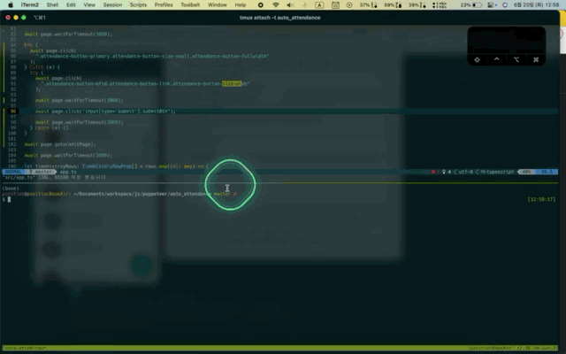

# 打刻助けくん(Money Forward 用)

> 派遣先の現場でも打刻
> 自社でも打刻で疲れているあなた
> 打刻は打刻助けくんに任せて
> 

## 概要

> 現場の打刻を自社に入力しないことになれすぎてもう４ヶ月。。
> 一個一個やるには、大変です。自分でやるとおよそ 1 時間の作業を 10 分で終わらせる為作りました。

## 主なライブラリ

| 区分 | 項目       | 説明                                                                     |
| ---- | ---------- | ------------------------------------------------------------------------ |
| 1    | nodejs     | 早めに作るには node が一番だと思います。                                 |
| 2    | typescript | 安定的なプログラミングもできるし、インテリセンスも抜群です。             |
| 3    | puppeteer  | このプログラムのコアです。Selenium より楽ちんです。                      |
| 4    | dotenv     | 自分の個人情報をパブリックなところに載せたくない時使います。環境変数指定 |

## 機動について

> 決められたフォーマットで excel 作成して置く必要はあります。
> 形式はすごくシンプル(日付、作業開始時間、作業終了時間)で内容を記載する必要があります。
> まぁ。。「Money Forward」では、excel アップロードがなさそうだったので現場の時間をコピーペーストする
> 感じで作ります。

<p style="color: red">致命的な問題はMoney ForwardホームページのUIに変更があったら修正が必要です；；</p>

Money Forward のアカウント情報を準備します。

> プロジェクト root に.env ファイルを作成します。以下のコードのように準備します。

```shell
# .env
MONEY_FORWARD_ID=ログインユーザID[メール]
MONEY_FORWARD_PW=パスワード
```

1. アプリを機動する前に以下のコマンドを実行し、関連のライブラリをダウンロードします。

```shell
yarn
```

2. アプリを機動します。

```shell
yarn start
```

- excel ファイル読み込み
- MF ログイン
- MF 打刻画面へ移動
- 打刻内容登録
